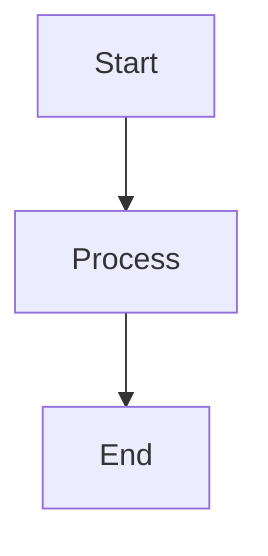
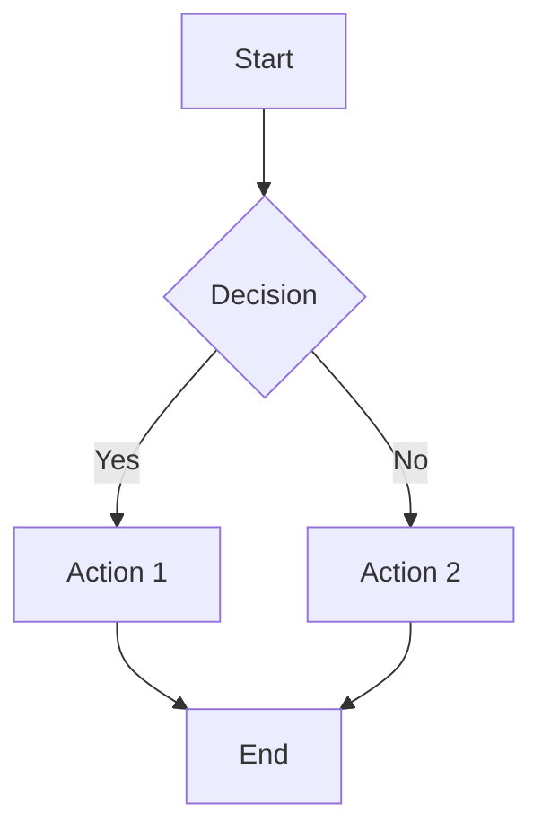
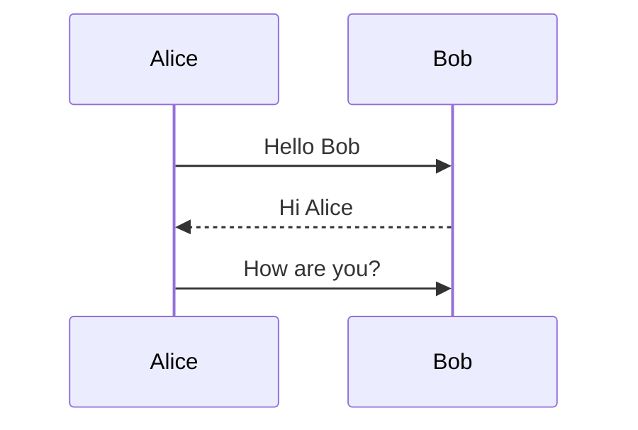
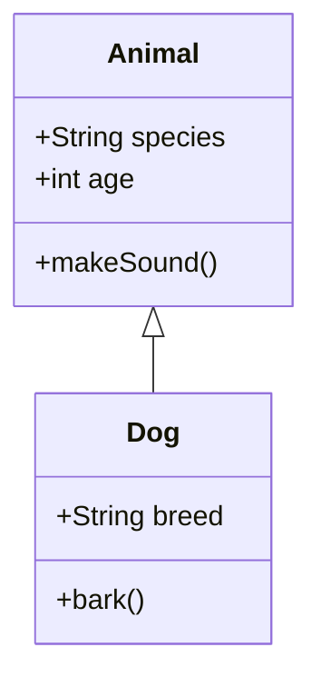
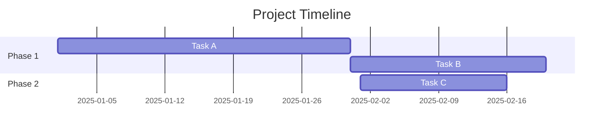
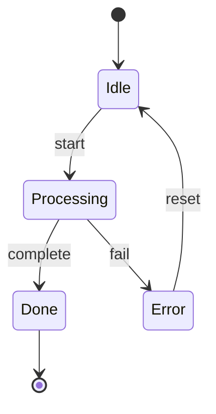
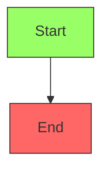
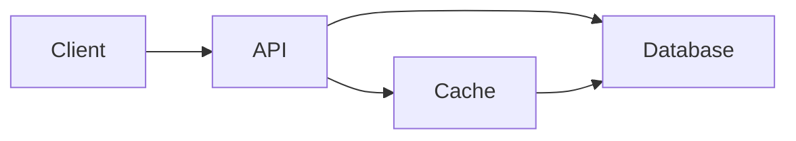

# Add Mermaid Diagram to Blog Post

Use this skill when the user asks to add a diagram (flowchart, sequence diagram, class diagram, Gantt chart, etc.) to a distill blog post.

## Front Matter Required

Enable Mermaid in the post's front matter:

```yaml
mermaid:
  enabled: true
  zoomable: true  # optional: allows zoom on click
```

## Syntax

Use a fenced code block with `mermaid` language identifier:

~~~markdown

~~~

## Diagram Types

### Flowchart



Direction options: `TD` (top-down), `LR` (left-right), `BT` (bottom-top), `RL` (right-left)

### Sequence Diagram



### Class Diagram



### Gantt Chart



### State Diagram



## Styling

Add custom styles within the diagram:



## Example in Post

~~~markdown
The system architecture is shown below:


~~~

## Notes

- Diagrams are rendered client-side using Mermaid.js
- Keep diagrams simple for readability
- Use descriptive labels for nodes
- Test complex diagrams in the [Mermaid Live Editor](https://mermaid.live/)
